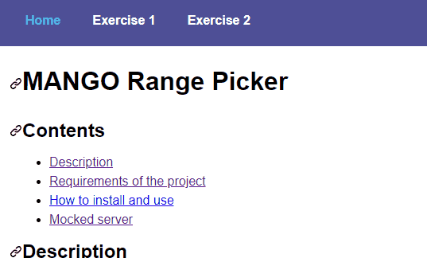

# MANGO Range Picker

## Contents

- [Description](#description)
- [Requirements of the project](#requirements-of-the-project)
- [How to install and use](#how-to-install-and-use)
- [Mocked server](#mocked-server)

## Description

This repository contains a test project which consists in creating a range slider without using the HTML5 input range control.



## Requirements of the project

The `<Range />` component has to be able to accept either `min` and `max` values, between which the user will be able to choose whatever value, or a `rangeValues` prop, which will force the user to choose one of the specified values in the array.

## How to install and use

Just clone this git repository, and run in the terminal, targetting your cloned folder:

```
> npm install
> npm start
```

Then, you can access the application in `http://localhost:8080/`.

## Mocked server

There is a server set up to respond with mocked data so that the examples can load the components with the given response. The services used are the ones from [https://www.mockable.io/](https://www.mockable.io/).

### Free range response

Used in the **Exercise 1** page:

- URL: http://demo7610140.mockable.io/min-max
- Sample of response:

```
{
  "min": 1,
  "max": 100
}
```

### Fixed values response

Used in the **Exercise 2** page:

- URL: http://demo7610140.mockable.io/range-values
- Sample of response:

```
{
  "rangeValues": [1.99, 5.99, 10.99, 30.99, 50.99, 70.99]
}
```
